# ✈️ Awesome Airport Operations Management Software & Systems

  

  
  
  
  
  
  
  

---

## 🚀 Overview & Ecosystem

A curated directory of top **SaaS platforms**, enterprise systems, and **open-source GitHub projects** for **Airport Operations Management Systems (AMS)**, **Airport Operational Databases (AODB)**, **Flight Information Display Systems (FIDS)**, **Airport Collaborative Decision-Making (A-CDM)**, and **Ground Handling Resource Allocation**.

Whether you are an airport authority, airline IT team, airside ground handler, or software developer building next-generation aviation systems, this list covers vendor software and developer tools across commercial and open-source ecosystems.

---

## 📑 Table of Contents
- [🏢 SaaS/Hosted Platforms](#-saashosted-platforms)
- [🔓 Open-Source GitHub Projects](#-open-source-github-projects)
- [💡 How to Contribute](#-how-to-contribute)
- [💖 Support & Sponsorship](#-support--sponsorship)
- [⚠️ Disclaimer](#%EF%B8%8F-disclaimer)
- [📈 Star History](#-star-history)

---

## 🏢 SaaS/Hosted Platforms

> **📊 Market Overview:** The global Airport Management Systems (AMS) market is estimated at **$20.0 Billion – $45.7 Billion** (projected to reach $45.72 Billion by 2034 with a ~16.6% CAGR). The sector is **moderately to highly fragmented**, comprising specialized software providers, infrastructure integrators, and global aerospace enterprise conglomerates across flight information display, airside operations, and A-CDM sub-segments.

| Platform | Parent / Company | Company Size (Revenue / Valuation) | Starting Pricing | Free Tier / Trial Limit | Key Features & Focus |
| :--- | :--- | :--- | :--- | :--- | :--- |
| **[AirIT](https://www.airit.com/)** | Collins Aerospace / RTX Corp | ~$74.3B Revenue (Parent) / ~$140B Valuation ($20M Division Revenue) | $15,000 / year (Entry operational database & flight display base tier) | 30-day sales-assisted demonstration trial with sample flight data sandbox | Airport IT services offering flight information display systems (FIDS) and operational database solutions deployed at major international hubs like Philadelphia. |
| **[Amadeus Airport Operational Database](https://amadeus.com/en/airports/airport-operational-database)** | Amadeus IT Group | ~$7.69B (€6.5B) Revenue / ~$25B Valuation | $15,000 / year (Regional airport tier base contract) | 30-day proof-of-concept trial environment for up to 5 operator accounts | Central operational database consolidating real-time flight, resource, and passenger data for airport-wide situational awareness. |
| **[Amadeus ACUS](https://amadeus.com/en/airports)** | Amadeus IT Group | ~$7.69B (€6.5B) Revenue / ~$25B Valuation | $1,200 / month ($14,400 / year) per airport terminal gate/kiosk license | 30-day developer sandbox environment for CUSS/CUPPS integration testing | Cloud Common Use Service for flexible passenger processing, mobile check-in, and shared airport terminal infrastructure. |
| **[SITA Airport Management](https://www.sita.aero/solutions/sita-airport-management/)** | SITA | ~$1.5B Revenue / ~$3.0B Valuation | $12,000 / year (Tiered by annual passenger movement volume) | 30-day evaluation sandbox trial with simulated flight feeds for airport authorities | Integrated airport operations platform covering flight information, stand allocation, resource management, and A-CDM workflows. |
| **[ADB SAFEGATE OneControl](https://www.adbsafegate.com/)** | ADB SAFEGATE | ~$500M Revenue / ~$1.2B Valuation | $20,000 / year (Per integrated airfield and apron control module) | 14-day guided virtual simulation trial environment for airside operations staff | Unified airport operations control system connecting airside, apron, and terminal management with real-time situational awareness. |
| **[ADB Safegate Apron & Gate Systems](https://www.adbsafegate.com/)** | ADB SAFEGATE | ~$500M Revenue / ~$1.2B Valuation | $18,000 / year (Per terminal apron unit license) | 14-day guided virtual demonstration trial for ground operations team | Visual docking guidance, apron management solutions, and airside surveillance integration. |
| **[INFORM Airport Suite](https://www.inform-software.com/)** | INFORM GmbH | ~$120M Revenue / ~$300M Valuation | $10,000 / year (Per GroundStar resource optimization module) | 30-day proof-of-concept pilot instance for ground handling workforce management | AI-powered airport operations software suite featuring workforce optimization, turnaround management, and passenger flow analytics. |
| **[Veovo](https://www.veovo.com/)** | Veovo / LLR Partners | ~$50M Revenue / ~$150M Valuation | $8,000 / year (Entry passenger queue analytics module) | 30-day guided sandbox trial with up to 2 sensor data stream integrations | Predictive airport operations platform offering passenger flow forecasting, queue monitoring, and real-time asset allocation. |
| **[Damarel FiNDnet](https://www.damarel.com/)** | Damarel Systems | ~$12M Revenue / ~$30M Valuation | $5,000 / year (Per station for ground handling operations) | 30-day full-feature trial instance for accredited ground handling service providers | Airport resource management, slot management, and operational billing system designed for ground handlers and regional airports. |
| **[AeroCloud](https://aerocloudsystems.com/)** | AeroCloud Systems | ~$10M Revenue / ~$50M Valuation ($12.6M Series A raised) | $1,000 / month ($12,000 / year) for general aviation airfields ($3,500 / month for regional airports) | 14-day live software demo trial with up to 10 active flight track monitors | Cloud-native Airport Operating System (AOS) unifying flight management, AI gate allocation, FIDS, billing, and passenger management. |

---

## 🔓 Open-Source GitHub Projects

- **[Airport Management System Database Design](https://github.com/patilankita79/Airport-Management-System-Database-Design)**   
  Comprehensive database management project implemented in Oracle SQL, covering airport operations, airlines, passengers, staff deployment, and underlying operational workflow factors.

- **[Airport Management System (codeforgeyt)](https://github.com/codeforgeyt/airport-management)**   
  Multi-module Java Spring Boot application built with Maven for managing airport resources, flight operations, and passenger processing pipelines.

- **[Airport Management System (sharanyakamath)](https://github.com/sharanyakamath/Airport-Management-System)**   
  Full-stack web application developed with Python Django and MySQL for centralized management of airport flight schedules, ticketing, passenger records, and gate assignments.

- **[vACDM Plugin](https://github.com/vACDM/vacdm-plugin)**   
  EuroScope plugin implementing Airport Collaborative Decision Making (A-CDM) milestones, departure sequence planning, and flight status tracking for virtual air traffic simulation.

- **[vACDM Server](https://github.com/vACDM/vacdm-server)**   
  Backend server for vACDM providing real-time data sync, A-CDM milestone management (TOBT, TSAT, TTOT), and central telemetry coordination across airports.

- **[Airport Management System (sarina-hemmatpour)](https://github.com/sarina-hemmatpour/Airport-Managment-System)**   
  Desktop management software for airport operations featuring gate assignment, flight schedule monitoring, and employee role access control.

- **[OpenFIDS](https://github.com/henrus1/openfids)**   
  Free, self-hosted Flight Information Display System in PHP and SQL with multiple screen display layouts for regional airports and passenger lounges.

- **[Airport Management Access DB](https://github.com/FreezeHeat/AirportManagement)**   
  Relational database system implemented in Microsoft Access for tracking flight movements, crew assignments, and gate usage.

- **[Airport Management (Adecel)](https://github.com/Adecel/airport-management)**   
  Open-source application for tracking airport terminal operations, aircraft arrival/departure statuses, and facility resource schedules.

- **[FIDS Server (bhishekarora)](https://github.com/bhishekarora/FIDS)**   
  Flight Information Display System server written in Node.js, Angular, MySQL, and WebSockets featuring real-time screen management and customizable arrival/departure views.

- **[CDM Plugin (skyelaird)](https://github.com/skyelaird/CDM)**   
  EuroScope plugin implementing Eurocontrol Airport Collaborative Decision Making (A-CDM) milestones (EOBT, TOBT, TSAT, TTOT) for ATC simulation networks.

- **[A-CDM Simulator](https://github.com/A-CDMteam/SimuladorV2.0)**   
  Agent-based simulation environment for Airport Collaborative Decision Making (A-CDM) implementing Eurocontrol's 16 milestones, ETOT/TOBT time calculations, and multi-agent coordination.

- **[Airport Traffic Control Simulator](https://github.com/Henrique-Versiani/Airport-Traffic-Control)**   
  Air traffic control simulation in C with POSIX Threads modeling runways, gates, deadlock detection/resolution, priority aging, and resource contention.

- **[Airport Database Management System (Jana-Ahmed)](https://github.com/Jana-Ahmed-20005/Airport-database-managment-system)**   
  Database platform for optimizing flight scheduling, passenger check-in, baggage status tracking, and multi-role airport department access.

- **[Airport Management System (BDIZ)](https://github.com/soalko/BDIZ_Project)**   
  Python/PySide6 desktop application with PostgreSQL backend for managing aircraft, flights, tickets, crews, and data validation rules.

- **[Aeroporto Napoli Desktop Application](https://github.com/mattialemma/Applicativo_Aeroporto)**   
  Java Swing desktop application with PostgreSQL for centralized airport management, booking administration, lost baggage tracking, and delay monitoring.

- **[GestionAir](https://github.com/ffillouxdev/GESTIONAIR)**   
  Console application in C for managing airport flight operations, passenger boarding, schedule updates, and runway utilization optimization.

---

## 💡 How to Contribute

Contributions are welcome! Help us maintain the most comprehensive guide to airport management tools.

1. 🍴 **Fork** the repository.
2. 📝 **Add or update** entries in `README.md` following the standard table/list formats.
3. 🔗 Include official product links, factual descriptions, pricing tiers, and open-source Stars_Badges.
4. 🚀 **Submit a Pull Request** with a brief summary of additions.

See the main list of awesome repositories at [Awesome-Awesome-Awesome](https://github.com/ishandutta2007/Awesome-Awesome-Awesome).

---

## 💖 Support & Sponsorship

Thank you for visiting and supporting **Awesome Airport Operations**! 🌟

If you find this repository helpful for research, aviation software development, or industry benchmarking, please consider supporting the project:

- ⭐️ **Star this repository** to increase visibility on GitHub.
- 🍴 **Fork it** to customize or contribute back to the list.
- 📢 **Share it** with colleagues, aviation technologists, and airport managers.
- ☕ **Sponsor the developer** to support ongoing maintenance and new features:

  

---

## ⚠️ Disclaimer

- This list is **community-curated** for educational, analytical, and informational purposes — it does not constitute endorsement or commercial affiliation.
- Mission-critical airport operations software must strictly comply with international aviation regulations (ICAO Annex 14, FAA guidelines, EASA standards) and cybersecurity standards.
- Self-hosted open-source software should undergo rigorous security audits and reliability testing before operational airside deployment.

---

## 📈 Star History

